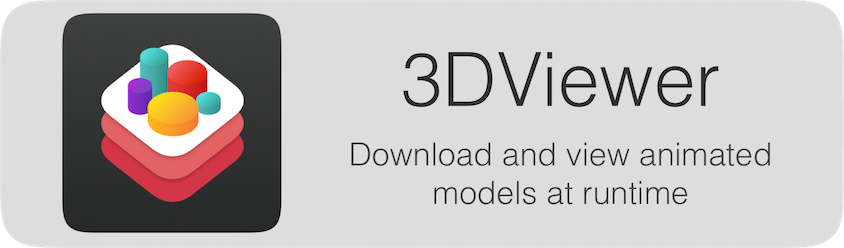

<p align="center">
    
</p>

**3DViewer** is small demo app for downloading 3d models and showing them in [`SceneKit`](https://developer.apple.com/scenekit/) at runtime.

The supported formats are: **3d, 3ds, ac, b3d, bvh, cob, dae, dxf, ifc, irr, md2, md5mesh, md5anim, m3sd, nff, obj, off, mesh, xml, ply, q3o, q3s, raw, smd, stl, wrl, xgl, zgl, fbx, md3**.

<p align="center">
    
</p>

For better results please use models created in **3dsMax 2010**.

## Features:

**1.** Download the 3d model files. You are able to:

* **start to download** by a specified `URl`

* **pause** download

* **resume** it

* and **cancel** it

In this app you're going to use the [`URLSession`](https://developer.apple.com/documentation/foundation/urlsession) download task to download .obj model file remotely to your app and report the progress to the user while bytes are being downloaded. The [`UIPasteboard`](https://developer.apple.com/documentation/uikit/uipasteboard) provides you with the needed link for 3d model.


**2.** `Open in..` feature.

**3.** Unziping archives.

**4.** Browsing local files with the help of the `FileManager`.

**5.** Loading a model file directly into an `SCNAssimpScene` from a device's internal `URL`. You're going to do it with the help of [`AssimpKit`](https://github.com/dmsurti/AssimpKit) which is a great framework for loading uncompressed models.


## Native approach:

It is also possible to use to use a downloaded `.dae` and `.obj` file and load it at runtime without `AssimpKit`.

To load `.obj` you need to use [`MDLAsset`](https://developer.apple.com/documentation/modelio/mdlasset) from Apple's [`ModelIO`](https://developer.apple.com/documentation/modelio) which was introduced at WWDC 2015. The steps are following:

* Extract the mesh from the asset

```swift
        // Create a MDLAsset from url
        let asset = MDLAsset(url:URL(fileURLWithPath: path))
        guard let object = asset.object(at: 0) as? MDLMesh else {
            fatalError("Failed to get mesh from asset.")
        }
```

* Create a `MDLMaterial` and add properties to it to describe the material

```swift
        // Create a material
       let scatteringFunction = MDLScatteringFunction()
       let material = MDLMaterial(name: "baseMaterial", scatteringFunction: scatteringFunction)

       // Apply the texture
       for  submesh in object.submeshes!  {
           if let submesh = submesh as? MDLSubmesh {
               submesh.material = material
           }
       }
```

* Create `SCNNode`


```swift
     // Wrap the ModelIO object in a SceneKit object
     let node = SCNNode(mdlObject: object)
```

What about Collada's .dae? If you try to use a downloaded .dae file and load it at runtime, you’ll get the following error:
```swift
scenekit COLLADA files are not supported on this platform.
```
That is happening because during the build time Apple applies some magic to the `scnassets` directory to optimize the included Collada files so usually at runtime `SceneKit` has a deal with compressed .dae files. But your Collada file wasn't there during that time, so if you are going to download .daes from remote `URL` and use them at runtime you'll need to run `scntool` script to compress them and then upload to your server.

For example place your .dae file to the ~/Desktop/ and run the following script in the Terminal:

```swift
xcrun scntool --convert yourmodelfile.dae --format c3d --output yourmodelfile-optimized.dae
```

That's it. Upload the compressed file and try to use it.

## License

[3DViewer's license](LICENSE.md) is based on the modified, 3-clause BSD-License.
