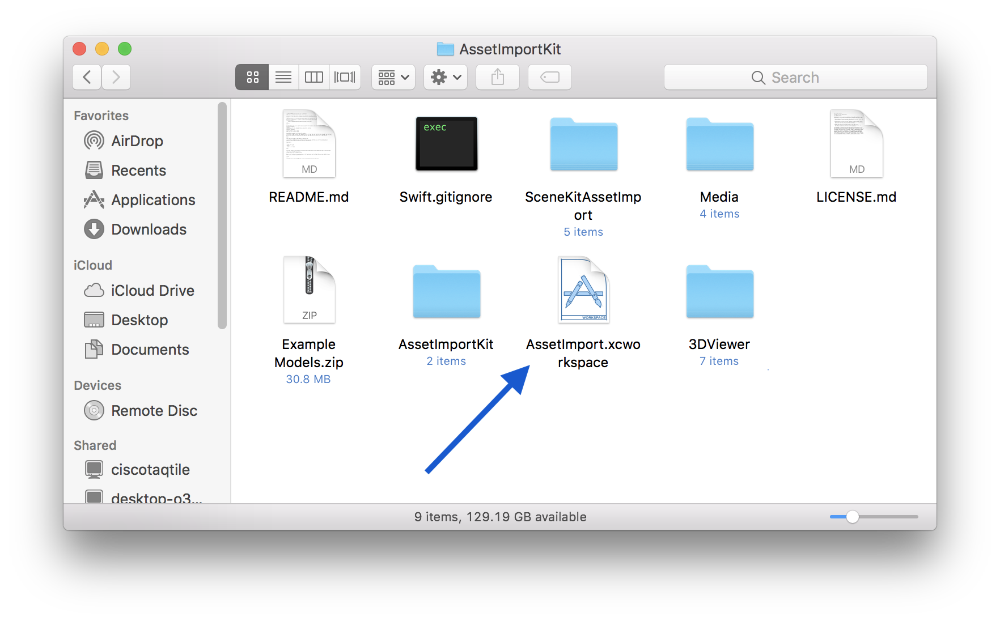
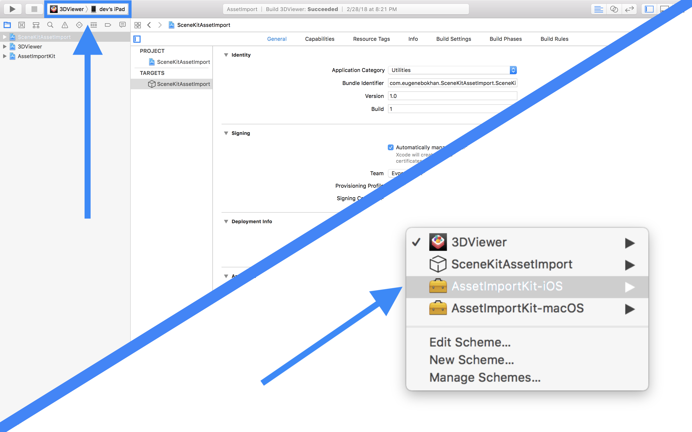
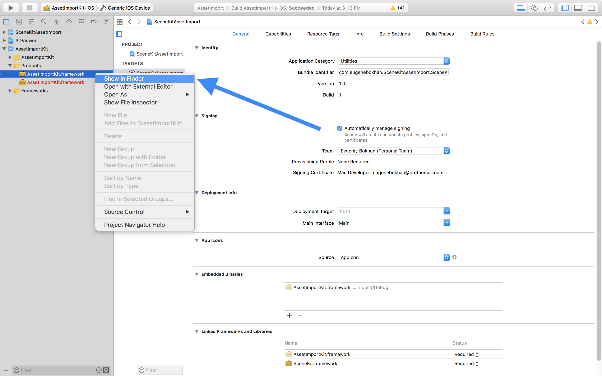
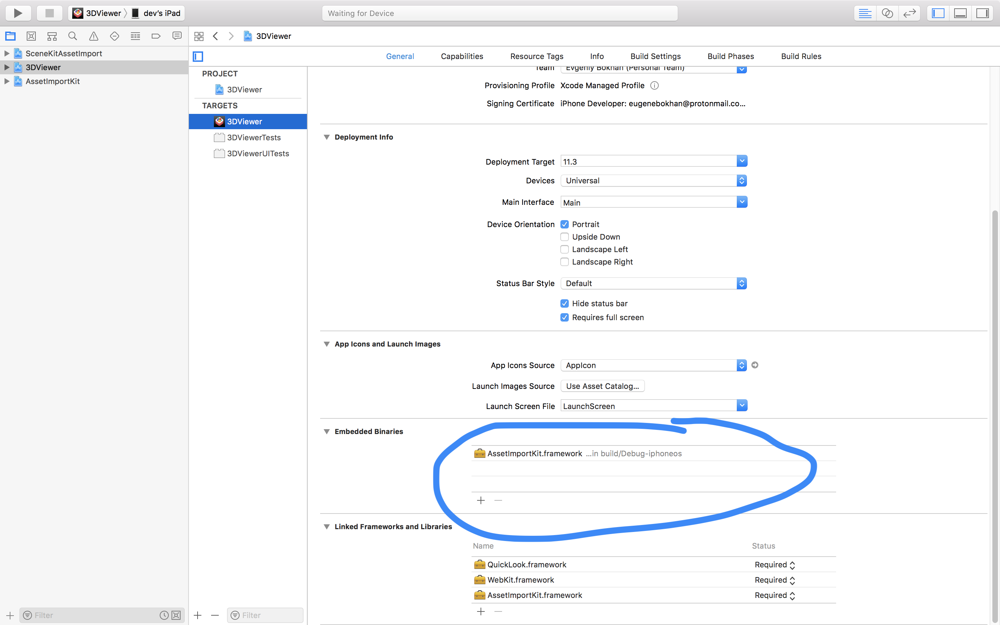

# How To Install Asset Import Kit

1. Open `AssetImport.xcworkspace`.

2. Choose `AssetImportKit-iOS` build scheme and `Generic Device` as destination. Press `command-B` to buld the framework.

3. Go to `AssetImportKit/Products`, right-click the `AssetImportKit.framework` and choose `Show in Finder`.

4. Now you got the framework! You are free to include it into your iOS application by adding it to the `Embedded Binaries`.

