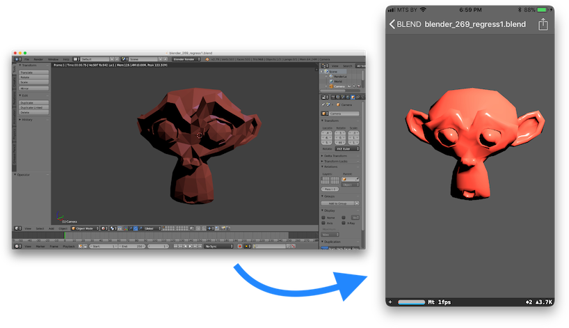

<p align="left">
    
</p>

[](https://opensource.org/licenses/BSD-3-Clause)

**AssetImportKit** is a cross platform library (macOS, iOS) that coverts the files supported by [`Assimp`](https://github.com/assimp/assimp) to [`SceneKit`](https://developer.apple.com/reference/scenekit) scenes.

<p align="center">
    
</p>

## Features

AssetImportKit allows you to import ***Assimp supported file formats*** directly in SceneKit at runtime.
The library supports:
* Geometry
* Materials (with color, embedded textures and external textures)
* Cameras and
* Skeletal animations.
* Serialization to `.scn` format

#### Supported file formats ####

AssetImportKit supports the following file formats: `3DS`, `3MF`, `COLLADA`, `FBX`, `GLTF`, `OBJ` `STL`.
If you want to add support of all `Assimp` importers, please look at my [`assimp-for-ios build script`](https://github.com/eugenebokhan/Assimp-iOS-Light-Superbuild).

## Demos

This repository includes 2 small demos for macOS and iOS.

<a href="3DViewer/README.md"></a><a href="SceneKitAssetImport/README.md"></a>

## Requirements

- Xcode 10 or later
- Swift 4.2
- iOS 11.3 or later
- macOS 10.13 or later

## Installation via `CocoaPods`

```Ruby
pod 'AssetImportKit'
```

## Manual Installation

In order to install `AssetImportKit` manually please read the [`How-to-Install`](HowToInstall.md) guide.

## Usage

```Swift
do {
  let assimpScene = try SCNScene.assimpScene(filePath: filePath,
                                              postProcessSteps: [.defaultQuality])
  if let modelScene = assimpScene.modelScene {
    modelScene.rootNode.childNodes.forEach {
      sceneView.scene?.rootNode.addChildNode($0)
    }
  }
} catch {
  print(error.localizedDescription)
}
```

Note for `iOS` builds: if you are developing an `iOS` application, set the `Enable Bitcode` under `Build Settings->Build Options` of your target to `NO`.

## Support the project

<a href="https://money.yandex.ru/quickpay/shop-widget?writer=seller&targets=Donation&targets-hint=&default-sum=&button-text=11&hint=&successURL=https%3A%2F%2Fgithub.com%2Feugenebokhan&quickpay=shop&account=410014480927275">

## License

[AssetImportKit's license](LICENSE) is based on 3-clause BSD-License.
