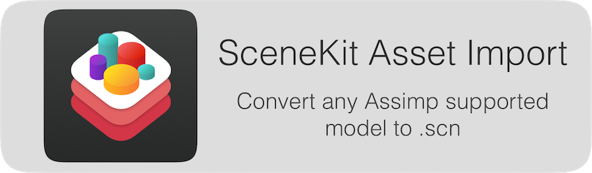
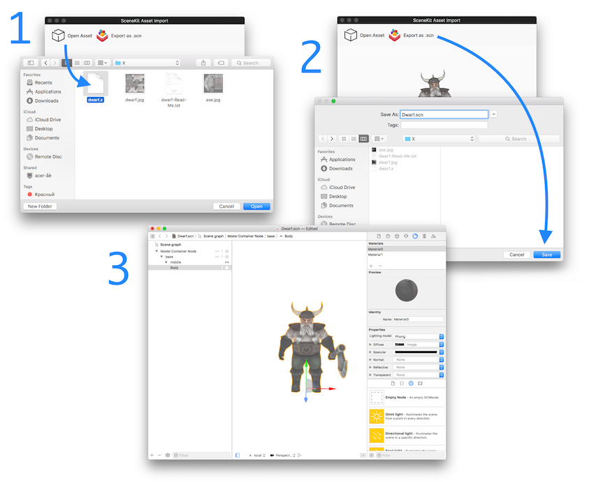

    

**SceneKitAssetImport** is small but very handy app for converting any 3d model that is supported by [`Assimp`](https://github.com/assimp/assimp) to [`SceneKit`](https://developer.apple.com/scenekit/) scene.

The supported formats are: **3d, 3ds, ac, b3d, bvh, cob, dae, dxf, ifc, irr, md2, md5mesh, md5anim, m3sd, nff, obj, off, mesh, xml, ply, q3o, q3s, raw, smd, stl, wrl, xgl, zgl, fbx, md3**.

## How To Use

    

## License

[SceneKitAssetImport's license](LICENSE.md) is based on the modified, 3-clause BSD-License.
